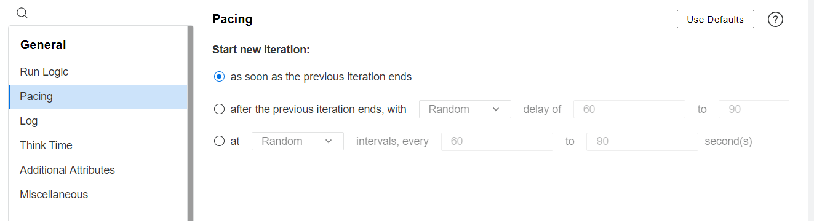
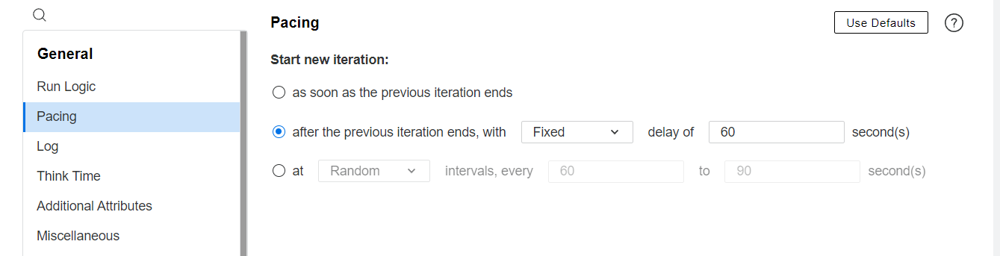
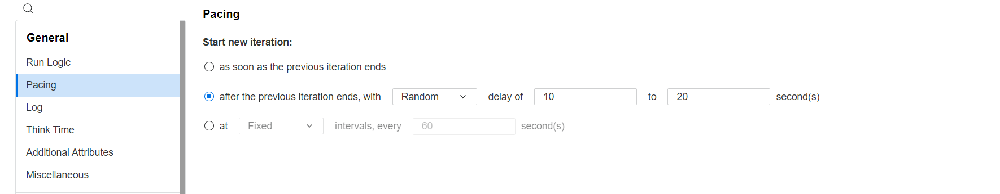
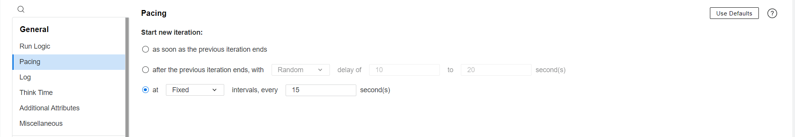
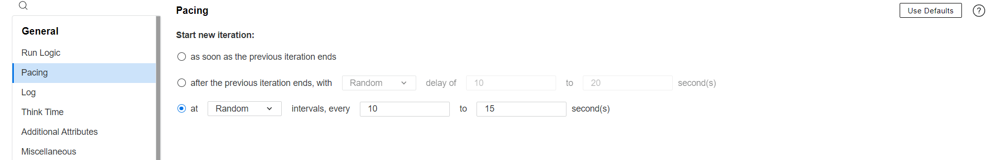

# LRE Runtime Settings (RTS) Reference Guide

This document provides a detailed reference for defining **Runtime Settings (RTS)** in LRE tests.    
It explains all possible fields, validation rules, formats, and defaults.
  
---  

## Overview

- RTS defines runtime settings applied to virtual users across all or specific groups in a test.
- RTS can be defined globally (`globalRts`) or per-group.
- If defined globally, Each RTS entry has a unique `name` and optional runtime configuration elements.

---  

## 1️⃣ Few RTS Examples.

```yaml  
groups:
  - name: "Group 1"                       # group 1 in the test
    script: "ee/scripts/mysampleScript"   # Script is defined using name along with its path
    pacing: "immediately"                 # no delay between iterations
    thinkTime: "ignore"                   # no think time applied
    log: "ignore"                         # logging is disabled

  - name: "Group 2"                       # another group
    script: "181"                         # Script is defined using script id
    pacing: "immediately"                 # no delay between iterations
    thinkTime: "ignore"                   # no think time applied
    log: "ignore"                         # logging is disabled

```  

```yaml
...
pacing: "fixed delay:5/3"             # Fixed 5-second delay, 3 iterations  
thinkTime: "modify:10*2.0"            # Modify think time: limit to 10 seconds, multiply recorded thinktime by 2  
log: "extended:on error:15:trace"     # enables extended logging on error, 15KB cache, trace logs
...
```  

```yaml
...
pacing: "fixed interval:8"            # Fixed interval of 8 seconds, default 1 iteration  
thinkTime: "modify:10*2.0"            # Modify think time: limit to 10 seconds, multiply recorded thinktime by 2  
log: "extended:on error:15:trace"     # enables extended logging on error, 15KB cache, trace logs  
jmeter: "StartMeasurements=true"      # Enable JMeter measurements
...
```  

```yaml  
...
pacing: "fixed delay:5/3"             # Fixed 5-second delay, 3 iterations  
thinkTime: "modify:10*2.0"            # Modify think time: limit 10s, multiply by 2×  
log: "extended:on error:15:trace"     # Extended logging on error, 15KB cache, trace only  
...
```  

```yaml
...
pacing: "fixed interval:8"            # Fixed interval of 8 seconds, default 1 iteration  
thinkTime: "random:80-120:15"         # Random 80–120% of recorded, capped at 15s  
log: "standard:on error:10"           # Standard logs on error, 10KB cache  
jmeter: "StartMeasurements=true"      # Enable JMeter performance metrics  
...
```  

```yaml
...
pacing: "random interval:10-15/5"     # Random interval 10–15s, 5 iterations  
thinkTime: "replay:10"                # Replay recorded think time, max 10s  
log: "extended:always:50:substitution,server,trace"   # Full extended logs (50KB)  
...
```  

## 2️⃣ RTS Object

**Fields:**

| Field       | Type   | Required   | Description                                                |  
|-------------|--------|------------|------------------------------------------------------------|  
| `name`      | String | Optional * | Unique name for this RTS.                                  |  
| `pacing`    | String | Optional   | Defines pacing strategy (see Pacing section).              |  
| `thinkTime` | String | Optional   | Defines user think time behavior (see Think Time section). |  
| `log`       | String | Optional   | Logging configuration (see Log section).                   |  
| `jmeter`    | String | Optional   | JMeter runtime options.                                    |  
| `selenium`  | String | Optional   | Selenium runtime options.                                  |  
| `javaVM`    | String | Optional   | Java VM settings (classpath, JDK path, parameters).        |  

> `*` `name` is optional for per-group RTS but **required** for global RTS.
  
---  

## 3️⃣ Pacing

- **Purpose:** Controls the delay between iterations for virtual users.
- **Defaults:**
  - `number of iterations` = 1
  - `Start new iteration` = `immediately`

**Supported formats:**

| Format                                     | Description                                                                  |  
|--------------------------------------------|------------------------------------------------------------------------------|  
| `immediately`                              | Start next iteration immediately.                                            |  
| `fixed delay:<seconds>/<iterations>`       | Fixed delay in seconds; optional iterations (default = 1).                   |  
| `random delay:<min>-<max>/<iterations>`    | Random delay between min and max seconds; optional iterations (default = 1). |  
| `fixed interval:<seconds>`                 | Fixed interval between iterations; optional iterations.                      |  
| `random interval:<min>-<max>/<iterations>` | Random interval between min and max seconds; optional iterations.            |  

**3.1. Immediate Start**

* No delay.
* Number of iterations defaults to 1.

```yaml  
# Start new iteration immediately after the previous  
pacing: immediately  
```  


**3.2. Fixed Delay**

* X → delay in seconds between iterations.

* /Y → number of iterations (optional, defaults to 1).

```yaml  
# Fixed 10-second delay, 1 iteration (default)  
pacing: fixed delay:10  
```  

```yaml  
# Fixed 5-second delay, 3 iterations  
pacing: fixed delay:5/3  
```  


**3.3. Random Delay**

* min-max → range of delay in seconds.

* /Y → number of iterations (optional, defaults to 1).

```yaml  
# Random delay between 5–15 seconds, 1 iteration  
pacing: random delay:5-15  
```  

```yaml  
# Random delay between 10–20 seconds, 2 iterations  
pacing: random delay:10-20/2  
```  



**3.4. Fixed Interval**

Interval controls the time between starting each iteration, regardless of iteration duration.

```yaml  
# Fixed interval of 8 seconds, default 1 iteration  
pacing: fixed interval:8  
```  

```yaml  
# Fixed interval 12 seconds, 4 iterations  
pacing: fixed interval:15/4  
```  




**3.5. Random Interval**

* Interval is randomly selected from the specified range.

* /Y → number of iterations (optional, defaults to 1).

```yaml  
# Random interval 20–25 seconds, 1 iteration  
pacing: random interval:20-25  
```  

```yaml  
# Random interval between 10–15 seconds, 5 iterations  
pacing: random interval:10-15/5  
```  




**3.6. Summary Table of Examples**

| Example                           | Type            | Format                | Meaning                        |  
|-----------------------------------|-----------------|-----------------------|--------------------------------|  
| `pacing: immediately`             | Immediate       | immediately           | Start immediately              |  
| `pacing: fixed delay:5/3`         | Fixed Delay     | fixed delay:X/Y       | 5 sec delay, 3 iterations      |  
| `pacing: random delay:10-20/2`    | Random Delay    | random delay:X-Y/Y    | Random 10–20 sec, 2 iterations |  
| `pacing: fixed interval:12/4`     | Fixed Interval  | fixed interval:X/Y    | 12 sec interval, 4 iterations  |  
| `pacing: random interval:10-15/5` | Random Interval | random interval:X-Y/Y | Random 10–15 sec, 5 iterations |  

### ✅ Key Rules:

* Iterations are optional, defaulting to 1.
* Iterations are effective only if scheduler is set to run until completion. 
* Delays and intervals must be positive integers.
* Random ranges must satisfy min ≤ max.
* Invalid formats will throw a PacingException.

---  

## 4️⃣ Think Time

- **Purpose:** Controls virtual user waiting time between actions.
- **Format:** Can be multipliers or percentage ranges.
- If not specified, defaults to `ignore` (no think time applied).
- **ThinkTime Types**

| Type     | Description                                                                |  
 |----------|----------------------------------------------------------------------------|
| `ignore` | No think time is applied.                                                  |  
| `replay` | Replay recorded think time, optional limit in seconds.                     |  
| `modify` | Modify recorded think time by a limit and/or multiply factor.              |  
| `random` | Random think time, between min/max percentages, optional limit in seconds. |  

**4.1 Valid Examples**

```yaml  
# No think time  
thinkTime: ignore  
```  

```yaml  
# Replay recorded think time, limit to 10 seconds max  
thinkTime: replay:10  
```  

```yaml  
# Modify think time: limit to 20 seconds, multiply by 1.5  
thinkTime: modify:20*1.5  
```  

```yaml  
# Random think time: between 50% and 150% of recorded, limit to 30 seconds  
thinkTime: random:50-150:30  
```  

```yaml  
# Random think time: between 80% and 120% of recorded (no time limit)  
thinkTime: random:80-120  
```  

```yaml  
# Modify think time: only multiply by 2.0 (no time limit)  
thinkTime: modify:*2.0  
```  

**4.2 Validation**

* Percentages must be integers.
* Min percentage ≤ Max percentage.
* Limits and multiply factors must be positive numbers.

**4.3 Complete Reference Table for ThinkTime**

| Type   | YAML Syntax                 | Limit | Multiply | Min % | Max % | Description                                                                |  
|--------|-----------------------------|-------|----------|-------|-------|----------------------------------------------------------------------------|  
| ignore | thinkTime: ignore           | -     | -        | -     | -     | No think time applied                                                      |  
| replay | thinkTime: replay           | -     | -        | -     | -     | Use recorded think time                                                    |  
| replay | thinkTime: replay:10        | 10    | -        | -     | -     | Use recorded think time but limit think time to max 10 sec                 |  
| modify | thinkTime: modify:*1.5      | -     | 1.5      | -     | -     | Multiply the recorded think time by 1.5                                    |  
| modify | thinkTime: modify:10*1.5    | 10    | 1.5      | -     | -     | Multiply the recorded think time by 1.5, but limit thinktime to max 10 sec |  
| modify | thinkTime: modify:15        | 15    | 1.0      | -     | -     | Multiply the recorded think time by 1, but limit thinktime to max 15 sec   |  
| random | thinkTime: random:80-120    | -     | -        | 80    | 120   | Random 80-120% of recorded                                                 |  
| random | thinkTime: random:80-120:15 | 15    | -        | 80    | 120   | Random 80-120% of recorded but limit thinktime to max 15s                  |  

  
---  

## 5️⃣ Logging

- **Purpose:** Configures log level, on-error behavior, and trace options.
- can be configured as **Ignore, Standard,** or **Extended**.
- If not specified, defaults to `standard: on error: 10` (standard logs on error, 10KB cache).

**5.1 Ignore Mode**

* Use when: You want no logs at all
* **Example:**

 ```yaml  
   log: ignore  
 ```  

**5.2 Standard Mode**

* **Use when:** You need basic logs, usually for debugging or lightweight monitoring.
* **Options:**
* **Always** → log everything.
    * **On Error** → log only if an error occurs.
* Optional **cache size** (limits KB of stored log. value should be between **1 and 100**).
* Choose Standard if:
    * You just want basic logging.
    * You don’t need parameter substitutions, server responses, or deep traces.

    * **Examples:**

 ```yaml  
  # Always log everything  
  log: standard:always  
 ```  

 ```yaml  
  # Log on error, limit cache to 20 KB  
  log: standard:on error:20  
 ```  

 ```yaml   
 # Log on error, limit cache to 1 KB  
 log: standard:on error:1  
 ```  

**5.3 Extended Mode**

* **Use when:** You need detailed logs for deep troubleshooting.
* **Options**:
    * **Always** or **On Error** (like Standard).
    * **Cache size** (KB). Value should be between **1 and 100**
* **Flags** to control log content:
    * `substitution` → log parameter substitutions
    * `server` → log server responses
    * `trace` → log advanced traces
        * Choose Extended if:
            * You need **parameter substitution logs** for debugging dynamic values.
            * You need **server response logs** for diagnosing API/backend issues.
            * You need **trace logs** for in-depth debugging.
            * You’re in **debugging or development mode**, not raw load-testing mode.

            * **Examples:**

 ```yaml  
  # Always log everything (all flags)  
  log: extended:always:substitution,server,trace  
 ```  

 ```yaml  
  # On error, 50 KB cache, all flags  
  log: extended:on error:50:substitution,server,trace  
 ```  

 ```yaml  
  # On error, 25 KB cache, only substitutions and traces  
  log: extended:on error:25:substitution,trace  
 ```  

# Complete Log Combinations Table

| Log Input - Examples                                 | Detail Level | Log Options - Send Messages | Limit Log Cache | Parameter Substitution | Data Returned by Server | Advanced Trace |  
|------------------------------------------------------|--------------|-----------------------------|-----------------|------------------------|-------------------------|----------------|  
| log: "ignore"                                        | IGNORE       | –                           | –               | ❌                      | ❌                       | ❌              |  
| log: "standard:always"                               | STANDARD     | Always                      | –               | ❌                      | ❌                       | ❌              |  
| log: "standard:on error:1"                           | STANDARD     | On Error                    | 1               | ❌                      | ❌                       | ❌              |  
| log: "extended:always"                               | EXTENDED     | Always                      | –               | ❌                      | ❌                       | ❌              |  
| log: "extended:on error:10"                          | EXTENDED     | On Error                    | 10              | ❌                      | ❌                       | ❌              |  
| log: "extended:always:substitution"                  | EXTENDED     | Always                      | –               | ✅                      | ❌                       | ❌              |  
| log: "extended:always:server"                        | EXTENDED     | Always                      | –               | ❌                      | ✅                       | ❌              |  
| log: "extended:always:trace"                         | EXTENDED     | Always                      | –               | ❌                      | ❌                       | ✅              |  
| log: "extended:always:substitution,server,trace"     | EXTENDED     | Always                      | –               | ✅                      | ✅                       | ✅              |  
| log: "extended:on error:1:substitution"              | EXTENDED     | On Error                    | 1               | ✅                      | ❌                       | ❌              |  
| log: "extended:on error:1:server"                    | EXTENDED     | On Error                    | 1               | ❌                      | ✅                       | ❌              |  
| log: "extended:on error:1:trace"                     | EXTENDED     | On Error                    | 1               | ❌                      | ❌                       | ✅              |  
| log: "extended:on error:1:substitution,server"       | EXTENDED     | On Error                    | 1               | ✅                      | ✅                       | ❌              |  
| log: "extended:on error:1:substitution,trace"        | EXTENDED     | On Error                    | 1               | ✅                      | ❌                       | ✅              |  
| log: "extended:on error:1:server,trace"              | EXTENDED     | On Error                    | 1               | ❌                      | ✅                       | ✅              |  
| log: "extended:on error:1:substitution,server,trace" | EXTENDED     | On Error                    | 1               | ✅                      | ✅                       | ✅              |  

  
---  

## 6️⃣ JMeter

JMeter runtime settings (jmeter) define performance test options for JMeter-based Vuser scripts executed within  
LoadRunner Enterprise (LRE).  
These settings control measurement capture, port usage, and runtime environment configuration.

- **Purpose:** Optional runtime parameters specific to JMeter executions.

```yaml  
jmeter: "<comma-separated key=value pairs>"  
```  

- **Defaults:**

* `StartMeasurements` = `true`
* `JMeterUseDefaultPort` = `false`
* `JMeterMinPort` and `JMeterMaxPort` are required if `JMeterUseDefaultPort=true`.
    * `JMeterHomePath` and `JREPath` default to system environment if not specified.

    - **Fields:**

| Field                  | Type    | Required    | Default | Description                                                            |  
 |------------------------|---------|-------------|---------|------------------------------------------------------------------------| 
| `StartMeasurements`    | Boolean | Optional    | `true`  | Whether to collect JMeter measurements during execution.               |
| `JMeterUseDefaultPort` | Boolean | Optional    | `false` | Whether to use the default JMeter communication ports.                 |  
| `JMeterMinPort`        | Integer | Conditional | —       | Minimum port number to use when `JMeterUseDefaultPort=true`.           |  
| `JMeterMaxPort`        | Integer | Conditional | —       | Maximum port number to use when `JMeterUseDefaultPort=true`.           |  
| `JMeterHomePath`       | String  | Optional    | —       | Path to JMeter home directory.                                         |  
| `JREPath`              | String  | Optional    | —       | Path to the Java Runtime Environment used by JMeter.                   |  
| `AdditionalParameters` | String  | Optional    | —       | Extra JMeter runtime parameters (comma-separated JVM args or options). |  

```yaml  
# Minimal JMeter configuration  
jmeter: "StartMeasurements=true"  
```  

```yaml  
#Enable measurement and define custom port range  
jmeter: "StartMeasurements=true,JMeterUseDefaultPort=true,JMeterMinPort=60000,JMeterMaxPort=60010"  
```  

```yaml  
# Full configuration with paths and JVM options  
jmeter: "StartMeasurements=true,JMeterUseDefaultPort=false,JMeterHomePath=c:/downloads/jmeterhome,JREPath=c:/jre/jrehome,AdditionalParameters=-Xmx1024m,-Xms512m"  
```  

  
---  

## 7️⃣ Selenium Runtime Settings

Selenium runtime settings (selenium) define runtime options for Selenium-based Vuser scripts executed within
LoadRunner  
Enterprise (LRE).  
These settings configure Java classpaths, TestNG files, and JRE paths used for Selenium execution.

**format:**

```yaml  
selenium: "<comma-separated key=value pairs>"  
```  

**Valid Examples:**

```yaml  
# Minimal configuration with only TestNG  
selenium: "TestNgFiles=testng.xml"  
```  

```yaml  
# Specify JRE path and TestNG suite  
selenium: "JREPath=C:\\java\\jdk,TestNgFiles=testng.xml"  
```  

```yaml  
# Full configuration with classpath, JRE, and TestNG  
selenium: "JREPath=C:\\java\\jdk,ClassPath=myclasspath.jar,TestNgFiles=testng.xml"  
```  

## 8️⃣ Java VM Settings

- **Purpose:** Defines Java Virtual Machine options for Java-based Vuser scripts.
- **Applicable to:** Java Vuser scripts only.

**Example:**

```yaml  
JavaVM: "UserSpecifiedJdk=true,JdkHome=C:\\Java\\jdk-17,JavaEnvClassPaths=lib/junit.jar;lib/hamcrest.jar,UseXboot=false"

```  

| Example                                                                                                                            | Description                                             |  
|------------------------------------------------------------------------------------------------------------------------------------|---------------------------------------------------------|  
| `JavaVM: "UserSpecifiedJdk=true,JdkHome=/usr/lib/jvm/java-17"`                                                                     | Uses a custom JDK from a specified path.                |  
| `JavaVM: "JavaVmParameters=-Xmx512m,EnableClassLoaderPerVuser=true"`                                                               | Sets memory options and enables isolated class loaders. |  
| `JavaVM: "JavaEnvClassPaths=lib/test.jar;lib/utils.jar,UseXboot=false"`                                                            | Defines custom classpaths and disables Xboot.           |  
| `JavaVM: "UserSpecifiedJdk=false,JavaVmParameters=-Xms256m -Xmx1024m -verbose:gc"`                                                 | Uses the default JDK but adds runtime parameters.       |  
| `JavaVM: "JavaEnvClassPaths=user_binaries\\myapp.jar,UserSpecifiedJdk=true,JdkHome=C:\\Program Files\\Java\\jdk-11,UseXboot=true"` | Comprehensive setup for controlled JVM execution.       |  

  
---